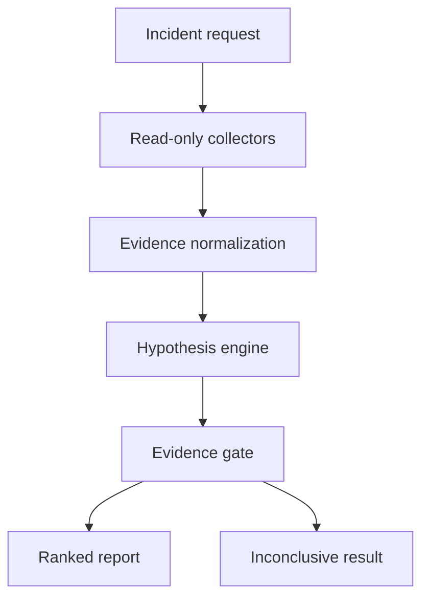

# Architecture

## Investigation flow

Only the normalization, deterministic hypothesis engine, evidence gate, and
reporting path exist in the first milestone. JSON fixtures stand in for live
collectors.

## Evidence contract

Every observation retains three fields:

| Field | Purpose | Example |
| --- | --- | --- |
| `name` | Stable signal identifier | `service.endpoint_count` |
| `value` | Observed value | `0` |
| `source` | System that produced it | `kubernetes` |

Collectors will later add timestamps, query windows, cluster identity, and
resource identity. Those fields are deferred until the first real collector so
the contract follows actual collection constraints rather than assumptions.

## Safety boundaries

The application is currently read-only. Diagnosis rules can recommend checks
or constrained actions, but cannot execute them. Future integrations must:

- use scoped service accounts with read-only permissions by default;
- allowlist Kubernetes resource kinds and Prometheus queries;
- cap time ranges, result sizes, and execution duration;
- redact secrets before evidence reaches a model or trace store;
- preserve the source behind every claim;
- return `inconclusive` when minimum evidence is absent;
- require policy approval and a dry run before any mutation.

## Why deterministic rules come first

A deterministic baseline makes the later agent measurable. The same incident
fixtures can compare rule-only, LLM-assisted, and hybrid approaches using:

- correct root-cause rank;
- unsupported-claim rate;
- evidence coverage;
- time and queries required to diagnose;
- frequency of unnecessary escalation;
- unsafe-action recommendation rate.

MLflow is a planned evaluation store for these runs. It is not used as a runtime
dependency in the initial CLI.

## Planned increments

1. Kubernetes collector for workload, event, probe, Service, and EndpointSlice
   evidence.
2. Prometheus collector with bounded query templates for CPU, memory, restarts,
   and request latency.
3. Investigation policy defining allowed queries and evidence requirements.
4. Constrained LLM adapter that proposes hypotheses but cannot invent tools.
5. MLflow-backed evaluation harness using reproducible fault scenarios.
6. Policy-gated dry-run remediation for a small allowlist of actions.
