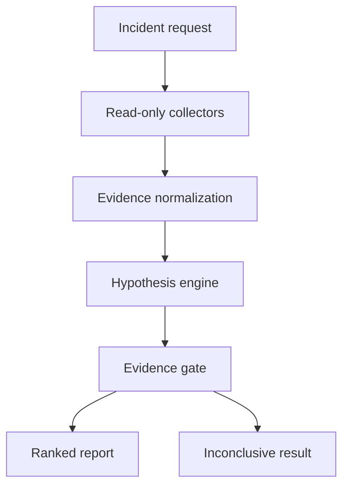

# Architecture

## Investigation flow

```mermaid
flowchart TD
    A[Incident request] --> B[Read-only collectors]
    B --> C[Evidence normalization]
    C --> D[Hypothesis engine]
    D --> E[Evidence gate]
    E --> F[Ranked report]
    E --> G[Inconclusive result]
```

Only the normalization, deterministic hypothesis engine, evidence gate, and
reporting path exist in the first milestone. JSON fixtures stand in for live
collectors.

## Evidence contract

Every observation retains its value, source, and collection outcome:

| Field | Purpose | Example |
| --- | --- | --- |
| `name` | Stable signal identifier | `service.endpoint_count` |
| `value` | Observed value | `0` |
| `source` | System that produced it | `kubernetes` |
| `status` | Whether the value can support diagnosis; defaults to `available` | `stale` |

### Collection outcomes

| Status | Meaning | Used by diagnosis rules? |
| --- | --- | --- |
| `available` | Collector supplied a complete, current observation | Yes |
| `unavailable` | Collection failed, for example a timeout or denied request | No |
| `empty` | Query succeeded but returned no matching observations | No |
| `stale` | Observation is outside the intended investigation window | No |
| `truncated` | Result is incomplete because a collection limit was reached | No |

A measured zero is `available` with `value: 0`. An empty result is not a
measured zero and cannot prove that a service has no endpoints. Non-available
outcomes may omit `value` or set it to null; available observations require a
non-null value. Unknown statuses are rejected. Existing fixtures without a
status retain their original behavior by defaulting to `available`.

Statuses are supplied by the fixture author today, and by collectors in a
future increment. The engine does not calculate freshness, detect pagination,
or contact backends. Conservatively excluding all truncated results avoids
claims about completeness; supporting individual facts from partial responses
would need a more detailed contract.

JSON reports retain `evidence_coverage` for every supplied signal, including
excluded ones, without copying their raw values into coverage metadata. Text
reports show the exclusions even when other evidence supports a diagnosis.
This inventory is not a claim that every necessary backend was queried.
An available Kubernetes OOM event can support the baseline diagnosis while
stale memory metrics remain excluded from its confidence score. The scores
are fixed rule weights, not calibrated probabilities.

Malformed numeric or boolean values cannot act as zero/false in a rule. Full
signal-schema validation is deferred; `available` alone does not guarantee a
value has the right type for a specific rule. No supported hypothesis means
`inconclusive`, not healthy. `missing_evidence` lists absent or excluded useful
signals when inconclusive; it is not a complete per-rule collection plan.

Collectors will later add timestamps, query windows, cluster identity, and
resource identity. Those fields are deferred until the first real collector so
the contract follows actual collection constraints rather than assumptions.

## Safety boundaries

The application is currently read-only. Diagnosis rules can recommend checks
or constrained actions, but cannot execute them. Future integrations must:

- use scoped service accounts with read-only permissions by default;
- allowlist Kubernetes resource kinds and Prometheus queries;
- cap time ranges, result sizes, and execution duration;
- redact secrets before evidence reaches a model or trace store;
- preserve the source behind every claim;
- return `inconclusive` when minimum evidence is absent;
- require policy approval and a dry run before any mutation.

## Why deterministic rules come first

A deterministic baseline makes the later agent measurable. The same incident
fixtures can compare rule-only, LLM-assisted, and hybrid approaches using:

- correct root-cause rank;
- unsupported-claim rate;
- evidence coverage;
- time and queries required to diagnose;
- frequency of unnecessary escalation;
- unsafe-action recommendation rate.

MLflow is a planned evaluation store for these runs. It is not used as a runtime
dependency in the initial CLI.

## Planned increments

1. Kubernetes collector for workload, event, probe, Service, and EndpointSlice
   evidence.
2. Prometheus collector with bounded query templates for CPU, memory, restarts,
   and request latency.
3. Investigation policy defining allowed queries and evidence requirements.
4. Constrained LLM adapter that proposes hypotheses but cannot invent tools.
5. MLflow-backed evaluation harness using reproducible fault scenarios.
6. Policy-gated dry-run remediation for a small allowlist of actions.
